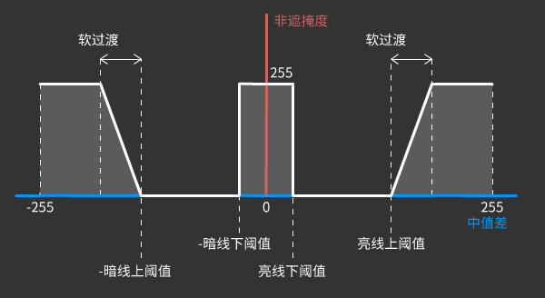

<a href="./GUI/Help/main_cn_s.md"><u>返回主页</u></a>

---
# 蜜蜡滤镜
帆室邻设计的专门用于除去腿毛等体毛的滤镜。

---
### 步骤 1
在使用此滤镜前，我推荐您首先选择皮肤区域。  
这个滤镜被设计用来除去图片中腿上、手臂上的体毛以及污点等。  
但是如果体毛过于浓密，该滤镜无法按预期工作。  
而如果体毛过于稀疏，请考虑使用“磨皮滤镜”而不是“蜜蜡滤镜”。  
请不要用蜜蜡在脸上脱毛。  
 

---
### 步骤 2
在应用蜜蜡滤镜后，请首先调整“中值核大小”。  
请耐心些，这个滤镜计算比较缓慢。  
较大的中值核去毛能力更强，但也会损伤图像高频细节。  
我不是很推荐您去修改压制阈值的参数。但如果您想深入了解该滤镜的用法，请阅读下面的步骤吧！

---
### 步骤 3
蜜蜡滤镜使用原图与中值滤波图之间的差值来决定原图中哪些像素会被覆盖掉。  
 
“中值差”的计算：  
原图 - 中值滤波图  
 
根据下图，原图中在暗线下阈值和暗线上阈值之间的暗线纹理，会被消除掉并用中值滤波图中的像素取代。  
收缩暗线下阈值和上阈值间的距离，将会留存原图更多暗线纹理。  
同理，原图中在亮线下阈值和亮线上阈值之间的亮线纹理将被取代。  

---
### 步骤 4
举几个例子： 
* 暗线纹理在升高暗线下阈值时会被更多地保留：  
 

* 黑线纹理在降低暗线上阈值时会被更多地保留：  
 

* 亮线纹理在升高亮线下阈值时会被更多地保留：  
 

* 白线纹理在降低亮线上阈值时会被更多地保留：  
 

---
### 步骤 5
关于软过渡：  
增大该值会使大中值差的像素点向原图过渡得更加自然。

---
<a href="./GUI/Help/main_cn_s.md"><u>返回主页</u></a>
