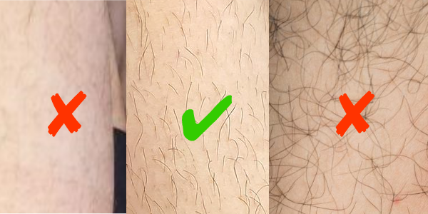
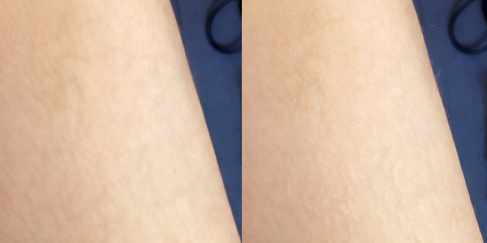

<a href="./GUI/Help/main_en.md"><u>Back to Homepage</u></a>

---
# Beeswax Filter
A special filter designed by Fanseline for leg/arm hair removal.

---
### Step 1
By start with this filter, I highly recommend you to select the skin first.  
This filter is designed to remove short leg/arm hair and stains from the skin in the image.  
However, if the body hair is too thick, this filter will not work as expected.  
On the other hand, if the body hair is too thin, please consider "Smooth Skin" filter instead of this one.  
Do not use beeswax filter on face.  
 

---
### Step 2
After applying beeswax filter to the skin, please adjust "Median K-Size" first.  
Be patient, this filter is a little slow.  
Larger K-size can remove body hair powerfully, but details of the image will also be affected.  
I do not recommend you to modify the default thresholds of the filter, but if you want to learn more about this filter, let's start!

---
### Step 3
Beeswax filter uses the difference between the median filtered image and the original image to determine whether the pixel will be masked or not.  
 
Calculation of the "median difference":  
Original Image - Median Filtered Image  
 
As shown in the following graph, dark lines (texture in the original image) between dark lower threshold and dark upper threshold will be eliminated and replaced by the pixels of the median filtered image.  
Shrink the differnece between dark lower and upper threshold will preserve more dark lines (texture).  
Similarly, bright lines (texture in the original image) between bright lower and upper will be replaced.  

---
### Step 4
Some examples: 
* Dark line texture will be preserved more when increasing dark-lower threshold:  
 

* Black line texture will be preserved more when decreasing dark-upper threshold:  
 

* Bright line texture will be preserved more when increasing bright-lower threshold:  
 

* White line texture will be preserved more when decreasing bright-upper threshold:  
 

---
### Step 5
About Soft Transition:  
Enlarge this value will make the transition of color with large median differnece more natural.

---
<a href="./GUI/Help/main_en.md"><u>Back to Homepage</u></a>
