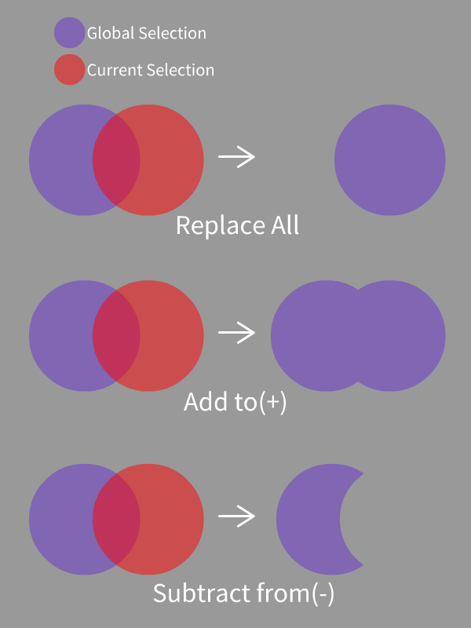

<a href="./GUI/Help/main_en.md"><u>Back to Homepage</u></a>

---
# Color Range
Select all pixels within the HSV color range.  
Auto skin select methods are also provided.  
Press SPACE to move and zoom in/out canvas in this mode.

---
### Step 1
If you want to select skin by using color range method, I highly recommend you to use the auto select method on the right column at first:
* Otsu-Cr: Otsu-Nobuyuki's method for Cr-channel skin color detection.
* HSV Auto: Select skin according to the built-in HSV color range.
* YCrCb Auto: Select skin according to the built-in YCrCb color range.

---
### Step 2
Well, if you want to select color manually, just click on the image to pick the color that you want to select.  
Then use the following sliders:
* H Tolerance: Set the select tolerance in H Channel.
* S Tolerance: Set the select tolerance in S Channel.
* V Tolerance: Set the select tolerance in V Channel.
* Soft Select: Color that out of the range will also be considered, but with less mask (selection) opacity.

---
### Step 3
If you want to adjust the edge of the current selection, you can use the following sliders:
* Grow: Expand the edge of current mask (selection).
* Contract: Shrink the edge of current mask.
* Feather Edge: Smooth and feather the edge of current mask.

You can fill small holes by applying grow and contract at the same time (morphological closing).  
 

---
### Step 4
You can now apply your current selection to the global selection by clicking the buttons on the right column:  
 

---
<a href="./GUI/Help/main_en.md"><u>Back to Homepage</u></a>
