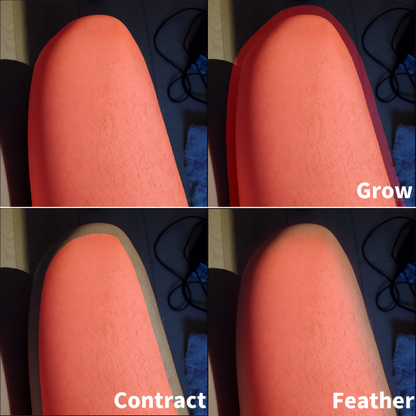

<a href="./GUI/Help/main_en.md"><u>Back to Homepage</u></a>
# Grabcut
An interactive select method for selecting objects automatically.  
Press SPACE to move and zoom in/out canvas in this mode.

---

### Step 1
Draw a rectangle around the skin (object) you want to process (ROI).  
If you want to reselect the area later, just click on "ROI Select" button and frame select again.  
You will be waiting for several seconds  before the result shows up.  
The area that has been selected currently will be marked in red.  
Grabcut Iteration: higher value will increase the select precision as well as the computing time.  
 

---
### Step 2
The selection maybe not perfect. Then you should mark the skin and the background manually.  
Firstly, click on the Subtract(-) button and mark the background.  
Reminder: You can change the brush size before marking.  
 

---
### Step 3
Secondly, click on the Add(+) button and mark the skin (foreground).  
 

---
### Step 4
If you want to adjust the edge of the current selection, you can use the following sliders:
* Grow: Expand the edge of current mask (selection).
* Contract: Shrink the edge of current mask.
* Feather Edge: Smooth and feather the edge of current mask.

You can fill small holes by applying grow and contract at the same time (morphological closing).  
 

---
### Step 5
You can now apply your current selection to the global selection by clicking the buttons on the right column:  
 

---
<a href="./GUI/Help/main_en.md"><u>Back to Homepage</u></a>
