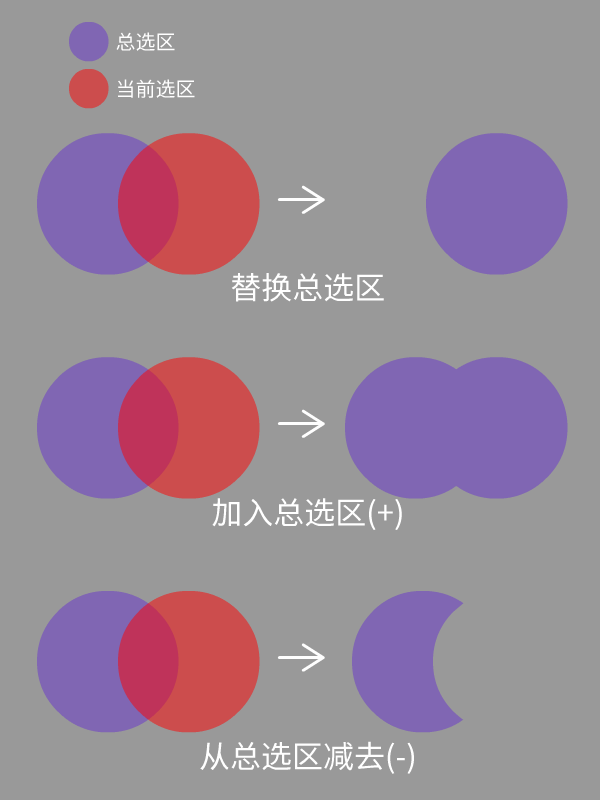

<a href="./GUI/Help/main_cn_s.md"><u>返回主页</u></a>

---
# 魔棒选取
根据选取点位置的颜色选取周围相似色区。  
在当前模式中请按住空格键来移动缩放画布。

---
### 步骤 1
首先得承认，这并不是个好用的选择工具，但我仍然做了出来。  
点击图片，将会根据色彩容差来选择周围的像素。  
您可以看到有两个容差滑块，皆在RGB通道上计算：
* 上容差：决定比点选像素“亮”多少的像素会被选取。
* 下容差：决定比点选像素“暗”多少的像素会被选取。

---
### 步骤 2
如果您想调整当前选区的边缘，您可以调整以下滑块：
* 扩张选区：使当前选区向四周扩张。
* 收缩选区：使当前选区向中心收缩。
* 羽化边缘：使当前选区边缘过渡变得平滑自然。

您可以同时扩张和收缩选区来填充选区中的缝隙（形态学闭运算）  
 

---
### 步骤 3
现在您可以点击右侧的几个按钮将当前选区应用到总选区中了：  
 

---
<a href="./GUI/Help/main_cn_s.md"><u>返回主页</u></a>
