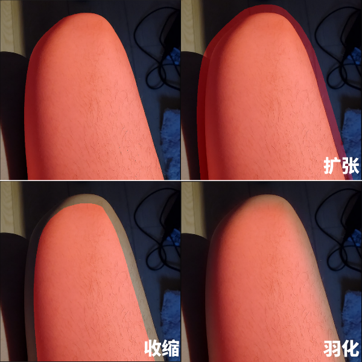
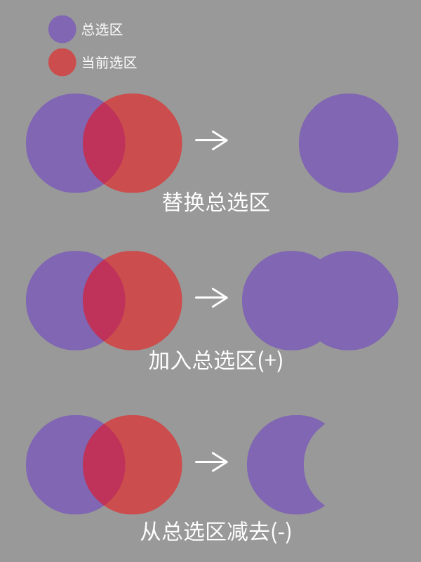

<a href="./GUI/Help/main_cn_s.md"><u>返回主页</u></a>

---
# 普通选取
绘制选区来进行选取的基础选择工具。  
在当前模式中请按住空格键来移动缩放画布。

---
### 步骤 1
这就是些简单的绘制选区工具而已。  
您可以用这些工具来手动选取填充一些缝隙。  
如果您想擦除当前选区，（比如使用选取橡皮擦），只需点击左侧的 减选(-) 按钮。  
 
快捷方式：撤销（Ctrl+Z），重做（Ctrl+Y）

---
### 步骤 2
如果您想调整当前选区的边缘，您可以调整以下滑块：
* 扩张选区：使当前选区向四周扩张。
* 收缩选区：使当前选区向中心收缩。
* 羽化边缘：使当前选区边缘过渡变得平滑自然。

您可以同时扩张和收缩选区来填充选区中的缝隙（形态学闭运算）  
 

---
### 步骤 3
现在您可以点击右侧的几个按钮将当前选区应用到总选区中了：  
 

---
<a href="./GUI/Help/main_cn_s.md"><u>返回主页</u></a>
