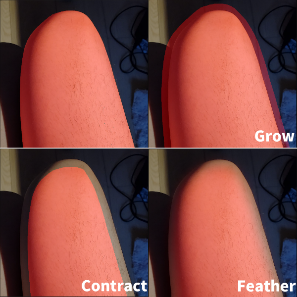
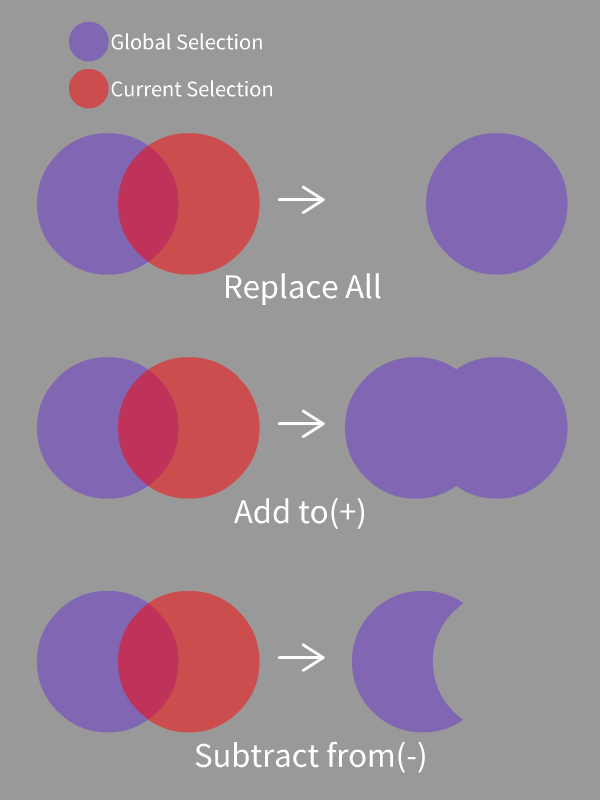

<a href="./GUI/Help/main_en.md"><u>Back to Homepage</u></a>

---
# Select Tools
Some basic select tools for selecting pixels based on shapes.  
Press SPACE to move and zoom in/out canvas in this mode.

---
### Step 1
Just some simple tools for drawing mask (selection).  
You can use these tools to fill holes on the mask manually.  
If you want to erase the mask (e.g., turn the mask brush into mask eraser), simply click on the Subtract(-) button on the left.  
 
Shorcuts: Undo(Ctrl+Z), Redo(Ctrl+Y)

---
### Step 2
If you want to adjust the edge of the current selection, you can use the following sliders:
* Grow: Expand the edge of current mask (selection).
* Contract: Shrink the edge of current mask.
* Feather Edge: Smooth and feather the edge of current mask.

You can fill small holes by applying grow and contract at the same time (morphological closing).  
 

---
### Step 3
You can now apply your current selection to the global selection by clicking the buttons on the right column:  
 

---
<a href="./GUI/Help/main_en.md"><u>Back to Homepage</u></a>
